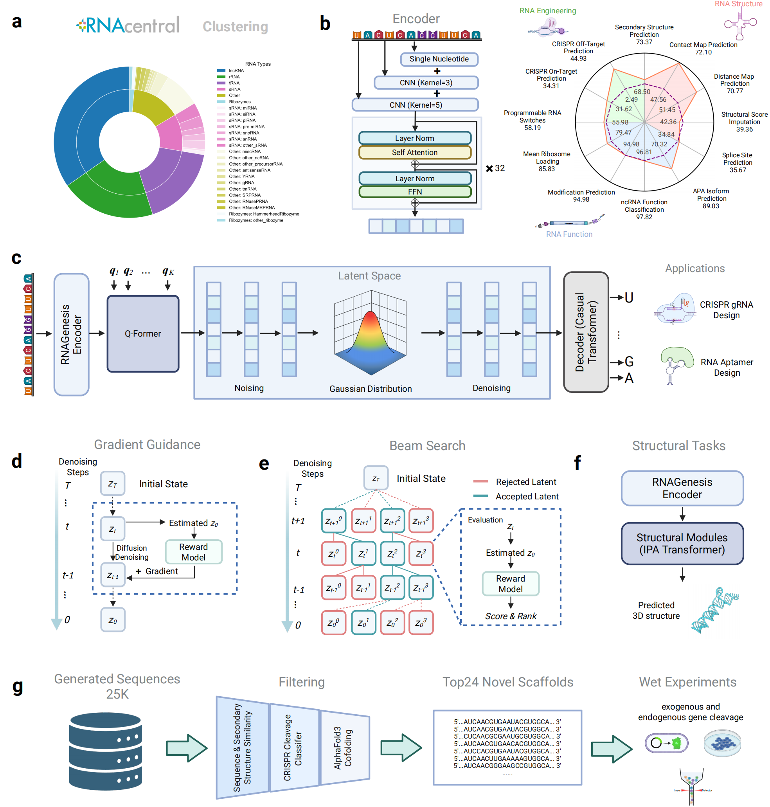
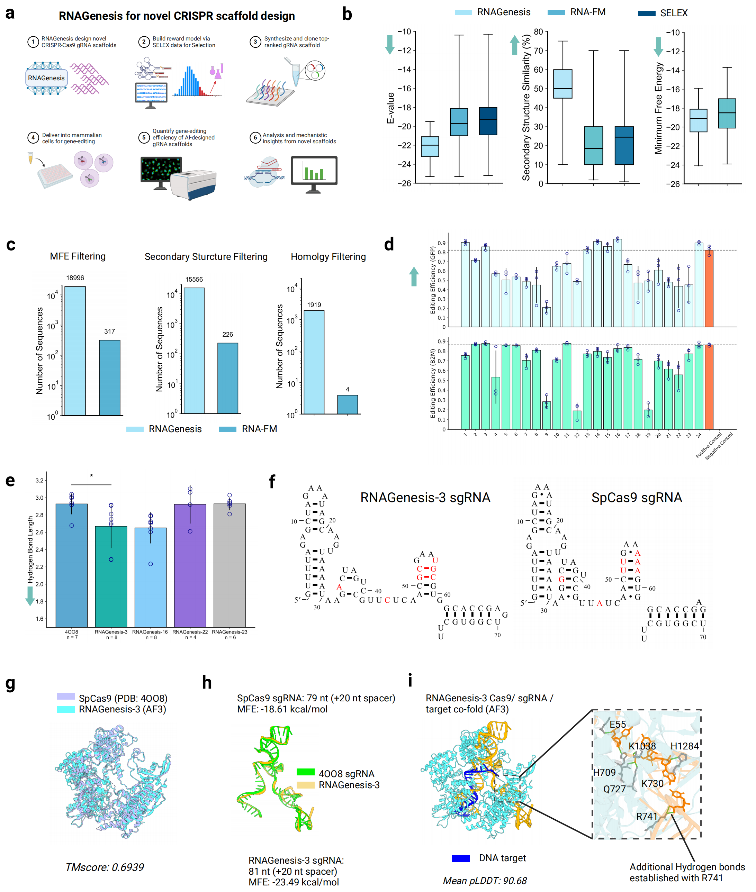

# RNAGenesis: Foundation Model for Enhanced RNA Sequence Generation and Structural Insights

<div align=center></div>

<div align=center>

[](https://www.biorxiv.org/content/10.1101/2024.12.30.630826v1)
[](https://x.com/BiologyAIDaily/status/1874420780341338129)

</div>

## 🚀 Overview

RNAGenesis is a foundation model that combines RNA sequence understanding and de novo design through latent diffusion. Key features include:

- Pioneers test-time directed generation optimization in RNA foundation models with tree search and model-guidance strategies
- Achieves state-of-the-art performance in RNA sequence understanding, leading in 9 of 13 benchmarks
- Generates diverse non-coding RNA sequences, including natural-like aptamers and optimized CRISPR sgRNAs
- Demonstrates superior gene knockout capabilities in wet-lab experiments compared to wildtype sgRNAs

## 📊 Results

### CRISPR sgRNA Design and Wet-lab Validation
<div align=center>

</div>

## 🛠️ Installation

### Option 1: Install via conda yaml file
```bash
# Create and activate conda environment
conda env create -f environment.yml
conda activate rnagenesis
```

### Option 2: Install via Conda and Pip
```bash
# Create and activate conda environment
conda create -n rnagenesis python=3.8.13
conda activate rnagenesis

# Install dependencies
pip install torch==2.1.2 torchvision==0.16.2 torchaudio==2.1.2
pip install transformers==4.32.1 diffusers==0.25.0 accelerate==0.25.0 logomaker==0.8 biopython==1.83 sentencepiece==0.1.99 huggingface-hub==0.28.1 wandb==0.19.6 pytorch-lightning==2.1.3 torchmetrics==1.2.1 xgboost==1.5.2 omegaconf==2.3.0
conda install numpy=1.22.0 pandas=1.3.1 scipy=1.10.1 matplotlib=3.7.1 seaborn=0.13.2 scikit-learn=0.24.0 jupyterlab=2.3.2 ipython=8.3.0 ipykernel=6.13.0 openssl=1.1.1o zlib=1.2.11 ca-certificates=2021.10.8 setuptools=59.5.0 wheel=0.37.1
```

## 📥 Download and Extract Model Weights
```bash
# Create checkpoints directory
mkdir -p checkpoints
mkdir -p configs

# Download model weights
wget https://zenodo.org/records/15203813/files/checkpoints.zip?download=1
wget https://zenodo.org/records/15203813/files/configs.zip?download=1
wget https://zenodo.org/records/15203813/files/progen2-base.zip?download=1
wget https://zenodo.org/records/15203813/files/progen2-small.zip?download=1

# Extract model weights
unzip checkpoints.zip -d checkpoints/
unzip configs.zip -d confiigs/
unzip progen2-base.zip -d models/autoencoder/decoder/checkpoints/progen2-base/
unzip progen2-small.zip -d models/autoencoder/decoder/checkpoints/progen2-small/

# Clean up
rm -f checkpoints.zip
rm -f configs.zip
rm -f progen2-base.zip
rm -f progen2-small.zip
```

## 📊 Inference Pipeline

### Inference Steps
1. Generation with RNAGensis:
   ```bash
   # RNAGenesis
   python generate.py \
     --batch_size 128 \
     --batch_num 200 \
     --eos_token "2" \
     --do_sample \
     --top_p 0.95 \
     --top_k 0 \
     --max_seq_len 37 \
     --enc_dec_file "configs/rnagenesis/autoencoder" \
     --dm_file "checkpoints/Aptamer/diffusion" \  # for aptamer generation
     --superfolder "generation_sequences" \
     --mid_folder "RNAGenesis_Aptamer"
   ```
   ```bash
   # RNAGenesis
   python generation.py \
     --batch_size 128 \
     --batch_num 200 \
     --eos_token "2" \
     --do_sample \
     --top_p 0.95 \
     --top_k 0 \
     --max_seq_len 64 \
     --enc_dec_file "configs/rnagenesis/autoencoder" \
     --dm_file "checkpoints/sgRNA/diffusion" \  # for sgRNA generation
     --superfolder "generation_sequences" \
     --mid_folder "RNAGenesis_sgRNA"
   ```
2. Generation with Guidance RNAGenesis:
   ```bash
   # guidance RNAGenesis
   python generation.py \
      --batch_size 128 \
      --batch_num 200 \
      --eos_token "2" \
      --do_sample \
      --top_p 0.95 \
      --top_k 0 \
      --max_seq_len 64 \
      --enc_dec_file "configs/rnagenesis/autoencoder" \
      --dm_file "checkpoints/sgRNA/diffusion" \  # for sgRNA generation
      --guidance \
      --target_class 0 \
      --guidance_classifier_model_config "configs/rangenesis/classifier/mlp_160_32.yaml" \
      --classifier_loss_type 'ce' \
      --guidance_scale 50.0 \
      --recurrence_step 1 \
      --superfolder "generation_sequences" \
      --mid_folder "Guid_sgRNA"
   ```
3. Generation with Beam-Search RNAGensis:
   ```bash
   # tree search RNAGenesis
   python generation.py \
     --batch_size 128 \
     --batch_num 200 \
     --eta 1 \
     --search_general \
     --search_goal "similarity" \
     --active_size 1 \
     --branch_size 8 \
     --eos_token "2" \
     --do_sample \
     --top_p 0.95 \
     --top_k 0 \
     --max_seq_len 37 \
     --enc_dec_file "configs/rnagenesis/autoencoder" \
     --dm_file "checkpoints/sgRNA/diffusion" \  # for sgRNA generation
     --superfolder "generation_sequences" \
     --mid_folder "BS_sgRNA"
   ```

## 📝 Citation

If you find this work helpful, please cite our paper:

```bibtex
@article{zhang2024rna,
  title={RNAGenesis: Foundation Model for Enhanced RNA Sequence Generation and Structural Insights},
  author={Zhang, Zaixi and Chao, Linlin and Jin, Ruofan and Zhang, Yikun and Zhou, Guowei and Yang, Yujie and Yang, Yukang and Huang, Kaixuan and Yang, Qirong and Xu, Ziyao and Zhang, Xiaoming and Cong, Le and Wang, Mengdi},
  journal={bioRxiv},
  pages={2024--12},
  year={2024},
  publisher={Cold Spring Harbor Laboratory}
}
```

## 🙏 Acknowledgments

We thank the following open-source projects for their valuable contributions:
- [RNAcentral](https://rnacentral.org/)
- [ViennaRNA](https://www.tbi.univie.ac.at/RNA/)
- [RNAfold](https://github.com/ViennaRNA/ViennaRNA)
- [RNApdbee 2.0](http://rnapdbee.cs.put.poznan.pl/)
- [3DNADSSR](https://x3dna.org/)
- [AlphaFold3](https://github.com/google-deepmind/alphafold)

## 📄 License

This project is licensed under the MIT License - see the LICENSE file for details.
